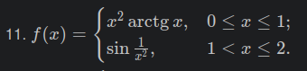
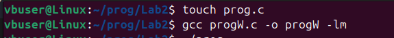
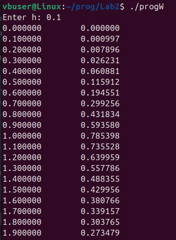
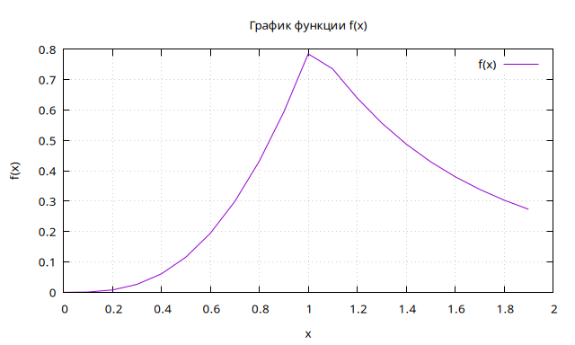

# Отчет
## Задание
1. Напишите программу по варианту, используя оператор цикла ``while``.
2. Напишите программу, используя оператор цикла ``for``.
3. Постройте график с использованием ``gnuplot``.
4. Составьте блок-схемы.
5. Оформите отчёт в README.md. Отчёт должен содержать:
    - Задание
    - Описание проделанной работы
    - Скриншоты результатов
    - Блок-схемы
    - График функции
    - Ссылки на используемые материалы
## Задание

## Описание проделанной работы
```C
#include <stdio.h>
#include <math.h>

double f(double x) {
    if (x>=0 && x<=1) {
        return x*x*atan(x);
    } else if (x>1 && x<=2) {
        return sin(1/(x*x));
    }
    return NAN;
}

int main() {
    double h, x = 0.0;

    printf("Введите шаг h: ");
    scanf("%lf", &h);

    FILE *file=fopen("graph.txt", "w");
    if(file==NULL) {
        printf("Ощибка при открытии файла\n");
        return 1;
    }

    x=0.0;
    while(x<=2.0) {
        fprintf(file, "%.6f\t%.6f\n", x, f(x));
        x += h;
    }

    fclose(file);

    printf("Данные успешно записаны в graph.txt");

    return 0;
}
```
1. Написать программу, подключив необходимые библеотеки,скомпилировать и запустить.
2. Вывести значения функции, где шаг h вводится пользователем
3. Записать результаты в файл ``"graph.txt"`` командой ``./prog > graph.txt``
4. Создать файл ``plot.gpi`` и вывольнить команду ``chmod +x plot.gpi``, далее вызвать команду ``./plot.gpi``
## Скриншоты результатов


## Блок-схемы

## График функции

## Ссылки на используемые материалы
- [Лабораторная №2](https://evil-teacher.on.fleek.co/prog_pm/term1/lab02/)
- [Gnuplot и с чем его едят](https://habr.com/ru/companies/ruvds/articles/517450/)
- [Циклические алгоритмы](https://acmp.ru/article.asp?id_text=517)