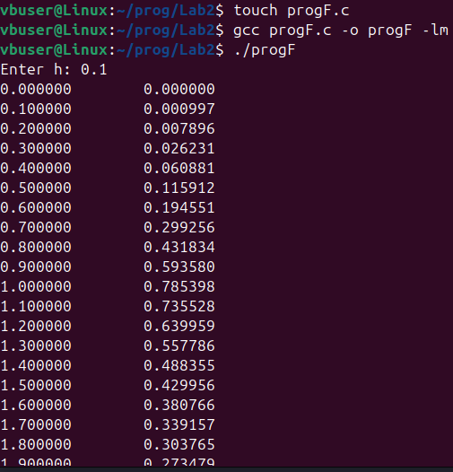
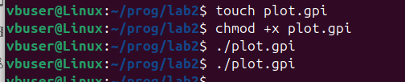
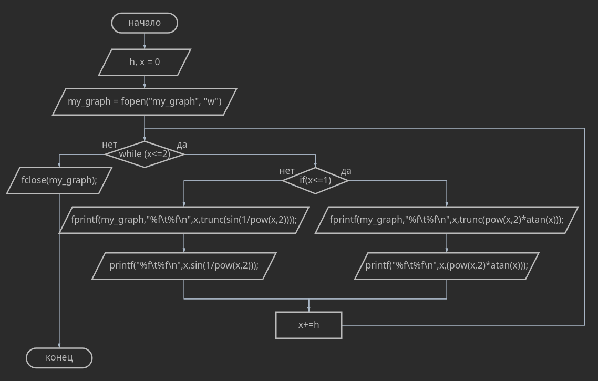
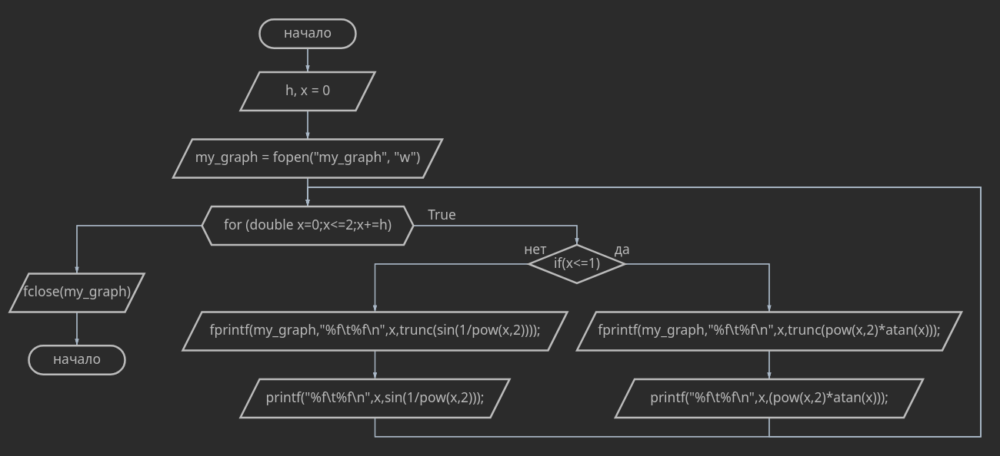

# Отчет
## Задание
1. Напишите программу по варианту, используя оператор цикла ``while``.
2. Напишите программу, используя оператор цикла ``for``.
3. Постройте график с использованием ``gnuplot``.
4. Составьте блок-схемы.
5. Оформите отчёт в README.md. Отчёт должен содержать:
    - Задание
    - Описание проделанной работы
    - Скриншоты результатов
    - Блок-схемы
    - График функции
    - Ссылки на используемые материалы
## Задание

## Описание проделанной работы
Программа с циклом `while`
```C
#include <stdio.h>
#include <math.h>

int main(){
    double h;
    FILE *my_graph;
    printf("Enter h: ");
    scanf("%le",&h);
    my_graph = fopen("my_graph","w");
    double x=0;
    while (x<=2)
    {
        if (x<=1)
        {
            fprintf(my_graph,"%f\t%f\n",x,trunc(pow(x,2)*atan(x)));
            printf("%f\t%f\n",x,(pow(x,2)*atan(x)));
        } 
        else
        {
            fprintf(my_graph,"%f\t%f\n",x,trunc(sin(1/pow(x,2))));
            printf("%f\t%f\n",x,sin(1/pow(x,2)));
        }
        x+=h;
    }
    fclose(my_graph);
    return 0;
}
```

Программа с циклом `for`
```C
#include <stdio.h>
#include <math.h>

int main(){
    double h;
    FILE *my_graph;
    printf("Enter h: ");
    scanf("%le",&h);
    my_graph = fopen("my_graph.txt","w");
        for (double x=0;x<=2;x+=h)
        {
        if (x<=1)
        {
            fprintf(my_graph,"%f\t%f\n",x,trunc(pow(x,2)*atan(x)));
            printf("%f\t%f\n",x,(pow(x,2)*atan(x)));
        }
        else
        {
            fprintf(my_graph,"%f\t%f\n",x,trunc(sin(1/pow(x,2))));
            printf("%f\t%f\n",x,sin(1/pow(x,2)));
        }
        }
    fclose(my_graph);
    return 0;
}
```
1. Написать программу, подключив необходимые библиотеки,скомпилировать и запустить.
2. Вывести значения функции, где шаг h вводится пользователем
3. Записать результаты в файл ``"graph.txt"`` командой ``./prog > graph.txt``
4. Создать файл ``plot.gpi`` и вывольнить команду ``chmod +x plot.gpi``, далее вызвать команду ``./plot.gpi``
## Скриншоты результатов




## Блок-схемы
С циклом `while`

С циклом `for`

## График функции

## Ссылки на используемые материалы
- [Лабораторная №2](https://evil-teacher.on.fleek.co/prog_pm/term1/lab02/)
- [Gnuplot и с чем его едят](https://habr.com/ru/companies/ruvds/articles/517450/)
- [Циклические алгоритмы](https://acmp.ru/article.asp?id_text=517)